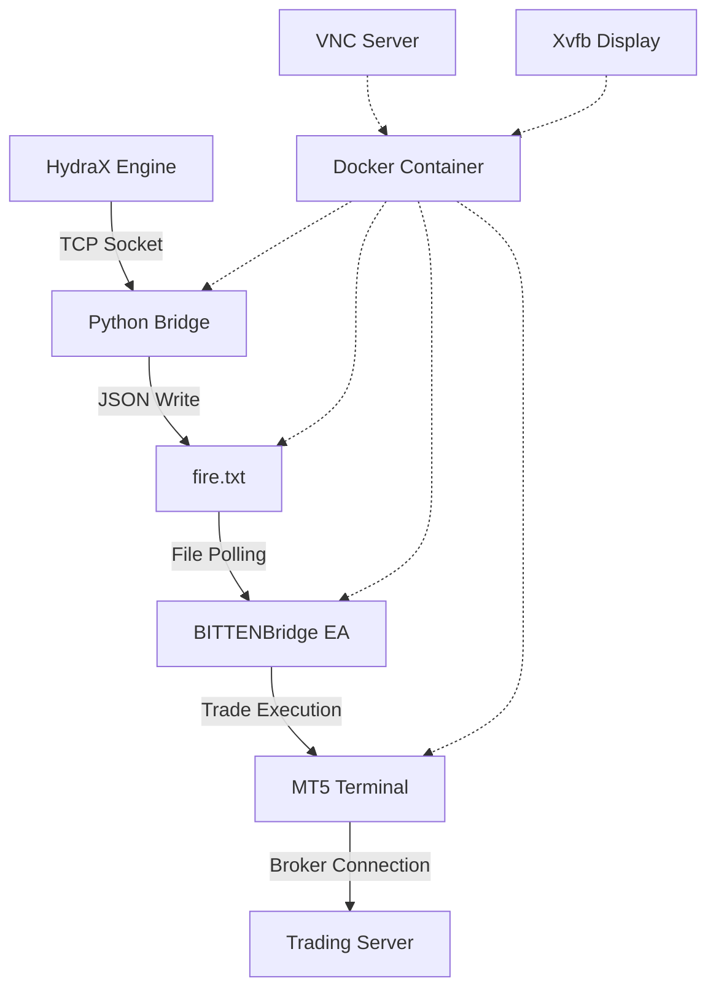

<<<<<<< HEAD
# BIT AWAKENS — Tactical Signal Suite

A real-time tactical signal engine built for HydraX/BITTEN.
Includes TCS++ scoring, stealth masking, special trade logic, and MT5 ghost feed compatibility.

Modules:
- tcs_engine.py
- stealth_protocol.md
- special_shot_protocol.md
- ghost_feed.py
- tcs_test_runner.py

Fully Claude-compatible.
=======
# HydraX MT5 Terminal Automation System

> **Industrial-grade MT5 terminal provisioning with Docker containerization and automated signal processing**

## 🚀 Quick Start

Deploy a fully configured MT5 terminal in under 60 seconds:

```bash
# 1. Clone the repository
git clone https://github.com/your-org/HydraX-MT5-Terminal-Automation.git
cd HydraX-MT5-Terminal-Automation

# 2. Deploy terminal with credentials
./spinup_terminal.sh \
  --login 123456 \
  --pass "your_password" \
  --server "YourBroker-Demo" \
  --port 9009 \
  --label TRADER_1

# 3. Send trading signals
echo '{"symbol":"EURUSD","side":"buy","tp":30,"sl":15}' | nc localhost 9009
```

## 📋 Table of Contents

- [Architecture](#-architecture)
- [Features](#-features)
- [Prerequisites](#-prerequisites)
- [Installation](#-installation)
- [Usage](#-usage)
- [Configuration](#-configuration)
- [Signal Format](#-signal-format)
- [Monitoring](#-monitoring)
- [Troubleshooting](#-troubleshooting)
- [API Reference](#-api-reference)

## 🏗️ Architecture



### Key Components

- **Docker Container**: Isolated MT5 environment with Wine64
- **Python Bridge**: TCP socket → file.txt signal processor  
- **BITTENBridge EA**: MT5 Expert Advisor for trade execution
- **VNC Server**: Remote access for debugging and monitoring
- **Template System**: Auto-attachment of EAs to 15+ trading pairs

## ✨ Features

### 🔧 **One-Line Deployment**
- Complete MT5 terminal setup in a single command
- Automatic Docker image building and container management
- Zero-configuration EA attachment via templates

### 🔐 **Credential Injection**
- Secure broker login automation
- Support for demo and live accounts
- Configurable server endpoints

### 🌉 **File-Based Signal Bridge**
- Reliable TCP socket → fire.txt communication
- Atomic file operations prevent race conditions
- Signal persistence and replay capability

### 📊 **Multi-Pair Support**
- Pre-configured for 115+ trading pairs
- Automatic chart loading with EA attachment
- Customizable timeframes and templates

### 🖥️ **Headless Operation**
- Virtual display (Xvfb) for GUI-less operation
- VNC access for remote debugging
- Process monitoring and auto-restart

### 🏭 **Production Ready**
- Container health monitoring
- Graceful shutdown handling
- Comprehensive logging and error handling

## 📋 Prerequisites

### System Requirements
- **OS**: Linux (Ubuntu 20.04+ recommended)
- **RAM**: 4GB+ per MT5 instance
- **CPU**: 2+ cores recommended
- **Storage**: 2GB+ free space
- **Network**: Internet access for broker connections

### Software Dependencies
- **Docker**: 20.10+
- **Docker Compose**: 1.29+ (optional)
- **netcat**: For signal testing

### Supported Brokers
- MetaQuotes Demo Server
- ICMarkets
- FTMO
- MyFXBook
- Any MT5-compatible broker

## 🛠️ Installation

### Method 1: Direct Clone
```bash
git clone https://github.com/your-org/HydraX-MT5-Terminal-Automation.git
cd HydraX-MT5-Terminal-Automation
chmod +x *.sh
```

### Method 2: Docker Image Only
```bash
docker build -f Dockerfile.mt5 -t hydrax-mt5 .
```

### Method 3: Pre-built Image
```bash
docker pull your-registry/hydrax-mt5:latest
```

## 📖 Usage

### Basic Terminal Deployment

Deploy a terminal with automatic login:

```bash
./spinup_terminal.sh \
  --login 123456 \
  --pass "secure_password" \
  --server "ICMarkets-Demo" \
  --port 9009 \
  --label EURUSD_SCALPER
```

### Manual Terminal (No Auto-login)

Deploy for manual configuration:

```bash
./spinup_terminal.sh \
  --port 9010 \
  --label MANUAL_SETUP
```

### Multiple Terminals

Deploy multiple terminals on different ports:

```bash
# Terminal 1 - Scalping
./spinup_terminal.sh --login 123456 --pass "pass1" --server "Broker1" --port 9001 --label SCALPER

# Terminal 2 - Swing Trading  
./spinup_terminal.sh --login 789012 --pass "pass2" --server "Broker2" --port 9002 --label SWING

# Terminal 3 - News Trading
./spinup_terminal.sh --login 345678 --pass "pass3" --server "Broker3" --port 9003 --label NEWS
```

## ⚙️ Configuration

### Environment Variables

| Variable | Default | Description |
|----------|---------|-------------|
| `BRIDGE_PORT` | 9013 | Internal bridge port |
| `MT5_LOGIN` | - | MT5 account number |
| `MT5_PASSWORD` | - | MT5 account password |
| `MT5_SERVER` | - | MT5 broker server |
| `USER_LABEL` | DEFAULT | Container identifier |
| `DISPLAY_NUM` | 99 | X11 display number |

### MT5 Configuration

The system uses these configuration files:

- `config/terminal.ini` - MT5 terminal settings
- `MQL5/Profiles/Templates/BITTEN.tpl` - EA template
- `MQL5/Profiles/Charts/Default.chr` - Chart layout
- `BITTEN_115_pairs.yml` - Trading pairs configuration

### Port Configuration

Each terminal requires 2 ports:

- **Bridge Port**: TCP socket for signals (e.g., 9009)
- **VNC Port**: Remote desktop access (Bridge Port + 1000)

Example for port 9009:
- Signal Port: 9009
- VNC Port: 10009

## 📡 Signal Format

### Basic Trade Signal

```json
{
  "symbol": "EURUSD",
  "side": "buy",
  "tp": 30,
  "sl": 15
}
```

### Advanced Signal Options

```json
{
  "symbol": "GBPJPY",
  "side": "sell",
  "lotsize": 0.1,
  "tp": 25,
  "sl": 12,
  "magic": 20250726,
  "comment": "HydraX Signal",
  "timestamp": "2025-01-20T15:30:00Z"
}
```

### Signal Fields

| Field | Type | Required | Description |
|-------|------|----------|-------------|
| `symbol` | string | ✅ | Trading pair (e.g., "EURUSD") |
| `side` | string | ✅ | "buy" or "sell" |
| `tp` | number | ✅ | Take profit in pips |
| `sl` | number | ✅ | Stop loss in pips |
| `lotsize` | number | ❌ | Position size (default: 0.01) |
| `magic` | number | ❌ | Magic number (default: 20250726) |
| `comment` | string | ❌ | Trade comment |
| `timestamp` | string | ❌ | Signal timestamp |

### Sending Signals

#### Using netcat
```bash
echo '{"symbol":"EURUSD","side":"buy","tp":30,"sl":15}' | nc localhost 9009
```

#### Using curl
```bash
curl -X POST -d '{"symbol":"EURUSD","side":"buy","tp":30,"sl":15}' localhost:9009
```

#### Using Python
```python
import socket
import json

signal = {"symbol": "EURUSD", "side": "buy", "tp": 30, "sl": 15}
sock = socket.socket(socket.AF_INET, socket.SOCK_STREAM)
sock.connect(('localhost', 9009))
sock.send(json.dumps(signal).encode())
response = sock.recv(1024)
print(response.decode())  # Should print "FIRE_RECEIVED"
sock.close()
```

## 📊 Monitoring

### Container Status

```bash
# List running terminals
docker ps | grep hydrax-mt5

# View container logs
docker logs hydrax-mt5-TRADER_1 -f

# Monitor resource usage
docker stats hydrax-mt5-TRADER_1
```

### Bridge Health Check

```bash
# Test bridge connectivity
echo '{"symbol":"TEST","side":"buy","tp":1,"sl":1}' | nc localhost 9009

# Check fire.txt updates
docker exec hydrax-mt5-TRADER_1 tail -f /wine/drive_c/MetaTrader5/MQL5/Files/fire.txt
```

### VNC Access

Connect to running terminal via VNC:

```bash
# Using VNC viewer
vncviewer localhost:10009

# Using browser (if web VNC enabled)
open http://localhost:10009
```

### Process Monitoring

```bash
# Check MT5 and bridge processes
docker exec hydrax-mt5-TRADER_1 ps aux | grep -E "(terminal64|python|bridge)"

# Monitor system resources
docker exec hydrax-mt5-TRADER_1 top
```

## 🔧 Management Commands

### Start/Stop Terminals

```bash
# Stop terminal
docker stop hydrax-mt5-TRADER_1

# Start stopped terminal
docker start hydrax-mt5-TRADER_1

# Restart terminal
docker restart hydrax-mt5-TRADER_1

# Remove terminal completely
docker stop hydrax-mt5-TRADER_1
docker rm hydrax-mt5-TRADER_1
```

### Scaling Operations

```bash
# Deploy 5 terminals automatically
for i in {1..5}; do
  ./spinup_terminal.sh \
    --login "12345$i" \
    --pass "password$i" \
    --server "Demo-Server" \
    --port "$((9000 + i))" \
    --label "TRADER_$i"
done
```

### Bulk Signal Broadcasting

```bash
# Send signal to all terminals
for port in {9001..9005}; do
  echo '{"symbol":"EURUSD","side":"buy","tp":30,"sl":15}' | nc localhost $port
done
```

## 🐛 Troubleshooting

### Common Issues

#### 1. Container Won't Start

**Problem**: Docker container exits immediately

**Solution**:
```bash
# Check Docker logs
docker logs hydrax-mt5-TRADER_1

# Verify Docker daemon is running
systemctl status docker

# Check available resources
docker system df
```

#### 2. Bridge Not Responding

**Problem**: Signal sends fail or timeout

**Solution**:
```bash
# Check if bridge process is running
docker exec hydrax-mt5-TRADER_1 ps aux | grep python

# Test port connectivity
telnet localhost 9009

# Restart bridge manually
docker exec hydrax-mt5-TRADER_1 pkill python
docker exec hydrax-mt5-TRADER_1 python3 /bridge.py 9013 /wine/drive_c/MetaTrader5/MQL5/Files/fire.txt &
```

#### 3. MT5 Installation Failed

**Problem**: MT5 terminal won't install in Wine

**Solution**:
```bash
# Check Wine configuration
docker exec hydrax-mt5-TRADER_1 winecfg

# Manually install MT5
docker exec hydrax-mt5-TRADER_1 wget -O /wine/drive_c/mt5setup.exe "https://download.mql5.com/cdn/web/metaquotes.ltd/mt5/mt5setup.exe"
docker exec hydrax-mt5-TRADER_1 wine /wine/drive_c/mt5setup.exe
```

#### 4. VNC Connection Issues

**Problem**: Cannot connect to VNC server

**Solution**:
```bash
# Check VNC server status
docker exec hydrax-mt5-TRADER_1 ps aux | grep x11vnc

# Check port mapping
docker port hydrax-mt5-TRADER_1

# Restart VNC server
docker exec hydrax-mt5-TRADER_1 pkill x11vnc
docker exec hydrax-mt5-TRADER_1 x11vnc -display :99 -nopw -listen 0.0.0.0 -forever -rfbport 5900 &
```

## 🔐 Security Considerations

### Credential Management
- Never commit passwords to version control
- Use environment variables for sensitive data
- Consider Docker secrets for production

### Network Security
- Bind bridge ports only to localhost in production
- Use firewall rules to restrict access
- Consider VPN for remote VNC access

### Container Security
- Run containers with limited privileges
- Use read-only filesystem where possible
- Regularly update base images

## 📄 License

This project is licensed under the MIT License - see the [LICENSE](LICENSE) file for details.

## 🤝 Contributing

1. Fork the repository
2. Create a feature branch
3. Make your changes
4. Add tests if applicable
5. Submit a pull request

## 📞 Support

For support and questions:
- **Documentation**: Check this README and inline code comments
- **Issues**: Report bugs via GitHub Issues
- **Testing**: Use the provided test commands to verify functionality

---

**⚡ HydraX - Industrial MT5 Automation at Scale**
