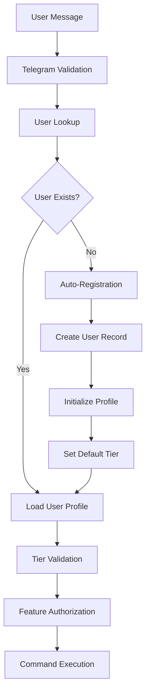
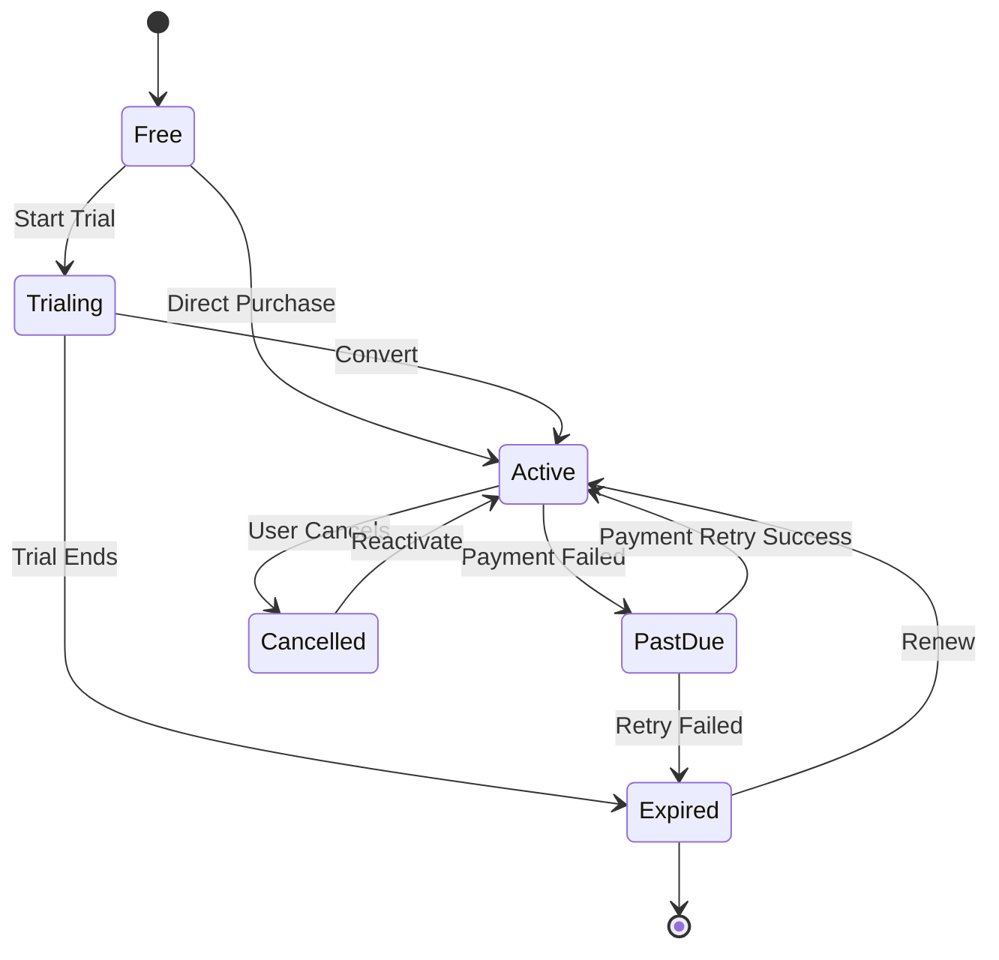
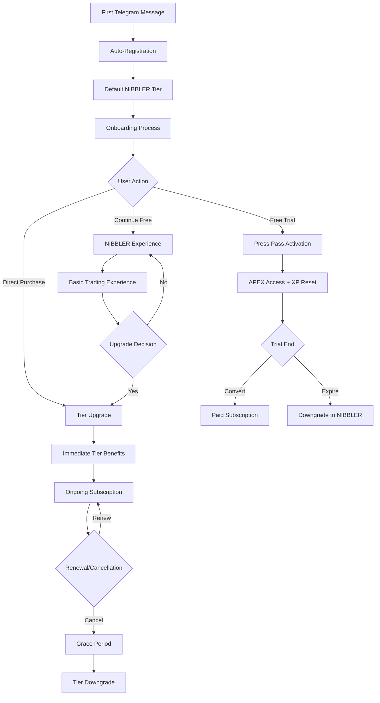

# HydraX-v2 User Management & Tier System Specifications

## Table of Contents
1. [System Architecture Overview](#system-architecture-overview)
2. [Tier System Design](#tier-system-design)
3. [Authentication & Authorization](#authentication--authorization)
4. [Subscription Management](#subscription-management)
5. [Press Pass Implementation](#press-pass-implementation)
6. [User Progression System](#user-progression-system)
7. [Achievement System](#achievement-system)
8. [Social Features](#social-features)
9. [User Data Models](#user-data-models)
10. [Database Schema](#database-schema)
11. [User Lifecycle Management](#user-lifecycle-management)
12. [Technical Implementation](#technical-implementation)

---

## System Architecture Overview

### Core Components

The HydraX-v2 user management system consists of several interconnected components:

```
┌─────────────────────────────────────────────────────────────────┐
│                    User Management System                      │
├─────────────────────────────────────────────────────────────────┤
│  ┌─────────────────┐  ┌─────────────────┐  ┌─────────────────┐  │
│  │   Tier System   │  │   Press Pass    │  │  Subscription   │  │
│  │                 │  │    Manager      │  │    Manager      │  │
│  └─────────────────┘  └─────────────────┘  └─────────────────┘  │
│  ┌─────────────────┐  ┌─────────────────┐  ┌─────────────────┐  │
│  │   Achievement   │  │   XP System     │  │  Social System  │  │
│  │     System      │  │                 │  │                 │  │
│  └─────────────────┘  └─────────────────┘  └─────────────────┘  │
│  ┌─────────────────┐  ┌─────────────────┐  ┌─────────────────┐  │
│  │   Risk Control  │  │   Auth System   │  │  User Profiles  │  │
│  │                 │  │                 │  │                 │  │
│  └─────────────────┘  └─────────────────┘  └─────────────────┘  │
└─────────────────────────────────────────────────────────────────┘
```

### Integration Points

- **Telegram Bot**: Primary user interface
- **MT5 Trading Platform**: Live trading integration
- **Payment Processors**: Stripe, PayPal, Crypto
- **Analytics Platform**: User behavior tracking
- **Email Service**: Automated campaigns
- **Web Dashboard**: User management interface

---

## Tier System Design

### Tier Hierarchy

The system implements a 5-tier subscription model with progressive feature unlocks:

#### 1. PRESS_PASS (Free Trial)
- **Price**: $0 (Limited time)
- **Duration**: 7-30 days
- **Purpose**: High-value trial to convert users
- **Features**:
  - Daily shots: 1
  - Risk per shot: 2.0%
  - Max open trades: 1
  - Manual execution only
  - **Unique**: XP resets nightly at 00:00 UTC
  - Access to APEX-tier features during trial

#### 2. NIBBLER (Entry Level)
- **Price**: $39/month
- **Target**: New traders
- **Features**:
  - Daily shots: 6
  - Risk per shot: 2.0%
  - Max open trades: 1
  - TCS minimum: 70
  - Manual execution only
  - Basic risk management

#### 3. FANG (Intermediate)
- **Price**: $89/month
- **Target**: Developing traders
- **Features**:
  - Daily shots: 10
  - Risk per shot: 2.0%
  - Max open trades: 2
  - TCS minimum: 85 (sniper), 75 (arcade)
  - **Unlocks**: Chaingun mode, Sniper access
  - Advanced risk controls

#### 4. COMMANDER (Advanced)
- **Price**: $139/month
- **Target**: Experienced traders
- **Features**:
  - Daily shots: 20
  - Risk per shot: 2.0%
  - Max open trades: 5
  - TCS minimum: 90 (auto), 75 (semi)
  - **Unlocks**: Auto-fire, Stealth mode
  - Professional risk management

#### 5. APEX (Elite)
- **Price**: $188/month
- **Target**: Professional traders
- **Features**:
  - Daily shots: 999 (unlimited)
  - Risk per shot: 2.0%
  - Max open trades: 10
  - TCS minimum: 91
  - **Unlocks**: Midnight Hammer, All features
  - Ultimate risk controls

### Tier Configuration System

```yaml
# From config/tier_settings.yml
tiers:
  PRESS_PASS:
    pricing:
      monthly_price: 0
    fire_settings:
      daily_shots: 1
      min_tcs: 60
      risk_per_shot: 2.0
    features:
      xp_reset_nightly: true
      has_apex_access: true
      
  NIBBLER:
    pricing:
      monthly_price: 39
    fire_settings:
      daily_shots: 6
      min_tcs: 70
      risk_per_shot: 2.0
    risk_control:
      drawdown_cap: 6.0
      max_open_trades: 1
      
  # ... (other tiers)
```

---

## Authentication & Authorization

### Authentication Flow



### User Registration Process

1. **Telegram Integration**: Automatic user registration on first message
2. **Profile Creation**: Initialize user profile with default values
3. **Tier Assignment**: Default to NIBBLER tier
4. **Onboarding**: Optional guided setup process
5. **Verification**: Email/phone verification for paid tiers

### Authorization Levels

#### Feature-Based Authorization
```python
class FeatureAuthorization:
    FEATURES = {
        'basic_trading': ['NIBBLER', 'FANG', 'COMMANDER', 'APEX'],
        'chaingun_mode': ['FANG', 'COMMANDER', 'APEX'],
        'auto_fire': ['COMMANDER', 'APEX'],
        'stealth_mode': ['COMMANDER', 'APEX'],
        'midnight_hammer': ['APEX'],
        'press_pass_trial': ['PRESS_PASS']
    }
```

#### Command-Level Authorization
```python
def requires_tier(min_tier: str):
    def decorator(func):
        def wrapper(user_id, *args, **kwargs):
            if not user_has_tier(user_id, min_tier):
                return unauthorized_response()
            return func(user_id, *args, **kwargs)
        return wrapper
    return decorator
```

---

## Subscription Management

### Subscription Lifecycle



### Billing Cycles

```python
class BillingCycle:
    MONTHLY = "monthly"
    QUARTERLY = "quarterly"  # 10% discount
    ANNUAL = "annual"       # 20% discount
    
    DISCOUNTS = {
        QUARTERLY: 0.10,
        ANNUAL: 0.20
    }
```

### Subscription Features

#### Auto-Renewal System
- **Payment Retry**: 3 attempts over 7 days
- **Grace Period**: 3 days after failure
- **Downgrade Protection**: Features locked, not removed immediately

#### Proration System
- **Upgrades**: Immediate access, prorated billing
- **Downgrades**: Features removed at next billing cycle
- **Cancellations**: Access until period end

#### Payment Methods
- **Stripe**: Primary processor for cards
- **PayPal**: Alternative payment method
- **Crypto**: Bitcoin, Ethereum support
- **Bank Transfer**: For enterprise clients

---

## Press Pass Implementation

### Core Concept

The Press Pass is a unique trial system that provides full APEX access but with a dramatic XP reset mechanism that occurs nightly at 00:00 UTC.

### XP Reset Mechanism

#### Daily Reset Process
```python
class PressPassResetManager:
    async def execute_nightly_reset(self):
        """Execute nightly XP reset for Press Pass users"""
        press_pass_users = await self.get_active_press_pass_users()
        
        for user_id in press_pass_users:
            current_xp = await self.xp_economy.get_balance(user_id)
            
            if current_xp > 0:
                # Save shadow stats
                await self.update_shadow_stats(user_id, current_xp)
                
                # Reset XP to 0
                await self.xp_economy.set_balance(user_id, 0)
                
                # Send dramatic notification
                await self.send_reset_notification(user_id, current_xp)
```

#### Shadow Statistics Tracking
```python
class ShadowStats:
    def __init__(self):
        self.real_total_xp = 0
        self.total_xp_wiped = 0
        self.reset_count = 0
        self.largest_wipe = 0
        self.lifetime_earned = 0
```

### Warning System

#### Notification Schedule
- **23:00 UTC**: 1-hour warning
- **23:45 UTC**: 15-minute final warning
- **00:00 UTC**: Reset execution notification

#### Warning Messages
```python
WARNING_MESSAGES = {
    'one_hour': "🚨 PRESS PASS ALERT: Your {xp} XP will be WIPED in 1 hour! Use /xpshop to spend now!",
    'fifteen_min': "⚠️ FINAL WARNING: {xp} XP will be DESTROYED in 15 minutes! Last chance to spend!",
    'reset_complete': "💀 PRESS PASS RESET: {xp} XP has been wiped from your account!"
}
```

### Press Pass Commands

```python
# Available commands
/presspass              # Show info and status
/presspass activate     # Enable Press Pass mode
/presspass deactivate   # Disable Press Pass mode
/presspass status       # Detailed status with countdown
/presspass stats        # Show shadow statistics
```

---

## User Progression System

### Experience Point (XP) System

#### XP Sources
```python
XP_SOURCES = {
    'trade_win': 50,
    'trade_loss': 10,
    'sniper_bonus': 25,
    'chaingun_completion': 100,
    'achievement_unlock': 'variable',
    'daily_login': 5,
    'referral_signup': 100,
    'perfect_day': 200
}
```

#### XP Multipliers
```python
XP_MULTIPLIERS = {
    'weekend_bonus': 1.5,
    'tier_bonus': {
        'NIBBLER': 1.0,
        'FANG': 1.1,
        'COMMANDER': 1.2,
        'APEX': 1.3
    },
    'streak_bonus': 'progressive',
    'event_bonus': 'variable'
}
```

### Rank System

#### Military-Style Ranking
```python
RANKS = {
    'RECRUIT': {'min_xp': 0, 'max_xp': 999},
    'PRIVATE': {'min_xp': 1000, 'max_xp': 2499},
    'CORPORAL': {'min_xp': 2500, 'max_xp': 4999},
    'SERGEANT': {'min_xp': 5000, 'max_xp': 9999},
    'LIEUTENANT': {'min_xp': 10000, 'max_xp': 19999},
    'CAPTAIN': {'min_xp': 20000, 'max_xp': 39999},
    'MAJOR': {'min_xp': 40000, 'max_xp': 74999},
    'COLONEL': {'min_xp': 75000, 'max_xp': 149999},
    'GENERAL': {'min_xp': 150000, 'max_xp': 299999},
    'FIELD_MARSHAL': {'min_xp': 300000, 'max_xp': None}
}
```

### Prestige System

#### Prestige Mechanics
- **Requirement**: Reach maximum rank
- **Benefit**: Prestige star, XP multiplier increase
- **Cost**: Rank reset to RECRUIT, keep achievements
- **Rewards**: Exclusive badges, bonus XP rates

```python
class PrestigeSystem:
    def calculate_prestige_bonus(self, prestige_level):
        return 1.0 + (prestige_level * 0.1)  # +10% per prestige
```

---

## Achievement System

### Achievement Categories

#### Combat Achievements
```python
COMBAT_ACHIEVEMENTS = {
    'first_blood': {'trades_won': 1, 'xp_reward': 100},
    'warrior_spirit': {'trades_won': 10, 'xp_reward': 250},
    'battle_master': {'trades_won': 100, 'xp_reward': 1000},
    'perfect_week': {'win_rate': 1.0, 'trades_min': 5, 'xp_reward': 500}
}
```

#### Progression Achievements
```python
PROGRESSION_ACHIEVEMENTS = {
    'level_10': {'level': 10, 'xp_reward': 200},
    'level_50': {'level': 50, 'xp_reward': 1500},
    'level_100': {'level': 100, 'xp_reward': 5000}
}
```

#### Special Achievements
```python
SPECIAL_ACHIEVEMENTS = {
    'beta_tester': {'beta_participant': True, 'xp_reward': 2500},
    'perfectionist': {'all_achievements': True, 'xp_reward': 20000},
    'press_pass_survivor': {'press_pass_days': 30, 'xp_reward': 3000}
}
```

### Achievement Tiers

```python
class AchievementTier:
    BRONZE = {'multiplier': 1.0, 'color': '#CD7F32'}
    SILVER = {'multiplier': 1.5, 'color': '#C0C0C0'}
    GOLD = {'multiplier': 2.0, 'color': '#FFD700'}
    PLATINUM = {'multiplier': 3.0, 'color': '#E5E4E2'}
    DIAMOND = {'multiplier': 5.0, 'color': '#B9F2FF'}
    MASTER = {'multiplier': 10.0, 'color': '#9400D3'}
```

### Badge System

#### Visual Effects
```python
BADGE_EFFECTS = {
    'bronze': ['subtle_glow'],
    'silver': ['glow', 'shine'],
    'gold': ['glow', 'shine', 'sparkle'],
    'platinum': ['glow', 'shine', 'sparkle', 'pulse'],
    'diamond': ['glow', 'shine', 'sparkle', 'pulse', 'prismatic'],
    'master': ['glow', 'shine', 'sparkle', 'pulse', 'prismatic', 'legendary_aura']
}
```

---

## Social Features

### Squad System

#### Squad Structure
```python
class Squad:
    def __init__(self):
        self.squad_id = str(uuid.uuid4())
        self.name = ""
        self.description = ""
        self.leader_id = None
        self.members = []  # List of user IDs
        self.max_members = 10
        self.join_type = "open"  # open, invite_only, closed
        self.created_at = datetime.now()
        self.squad_xp = 0
        self.squad_level = 1
```

#### Squad Features
- **Shared XP Pool**: Bonus XP for squad activities
- **Squad Challenges**: Group objectives
- **Leaderboards**: Inter-squad competition
- **Communication**: Private squad chat
- **Mentorship**: Senior member guidance

### Mentoring System

#### Mentor-Student Pairing
```python
class MentorshipProgram:
    def __init__(self):
        self.mentor_requirements = {
            'min_tier': 'FANG',
            'min_rank': 'SERGEANT',
            'min_trades': 100,
            'win_rate': 0.6
        }
        self.student_requirements = {
            'max_tier': 'NIBBLER',
            'max_rank': 'CORPORAL'
        }
```

#### Mentorship Benefits
- **Mentor Rewards**: XP bonus for student success
- **Student Benefits**: Guidance, tips, reduced risk
- **Mutual Growth**: Both parties gain from relationship
- **Achievement Unlock**: Special mentorship badges

### Referral System

#### Referral Mechanics
```python
class ReferralSystem:
    def __init__(self):
        self.referral_rewards = {
            'signup_bonus': 100,      # XP for referrer
            'tier_upgrade_bonus': 500, # XP when referred user upgrades
            'recurring_bonus': 0.05   # 5% of referred user's XP
        }
```

#### Referral Tracking
- **Unique Codes**: Each user gets a referral code
- **Attribution**: Track referral sources
- **Rewards**: Tiered rewards based on referral success
- **Leaderboards**: Top referrers recognition

---

## User Data Models

### Core User Model

```python
class User:
    def __init__(self):
        self.user_id = None
        self.telegram_id = None
        self.username = None
        self.email = None
        self.tier = 'NIBBLER'
        self.subscription_status = 'inactive'
        self.subscription_expires_at = None
        self.mt5_connected = False
        self.api_key = None
        self.is_active = True
        self.created_at = datetime.now()
        self.updated_at = datetime.now()
```

### Extended User Profile

```python
class UserProfile:
    def __init__(self):
        self.user_id = None
        self.total_xp = 0
        self.current_rank = 'RECRUIT'
        self.prestige_level = 0
        self.total_trades = 0
        self.winning_trades = 0
        self.total_profit_usd = 0.0
        self.largest_win_usd = 0.0
        self.best_streak = 0
        self.current_streak = 0
        self.achievements = []
        self.badges = []
        self.referral_code = None
        self.referred_by = None
        self.press_pass_active = False
        self.press_pass_shadow_stats = {}
```

### Trading Session Model

```python
class TradingSession:
    def __init__(self):
        self.session_id = None
        self.user_id = None
        self.session_date = None
        self.starting_balance = 0.0
        self.ending_balance = 0.0
        self.trades_taken = 0
        self.trades_won = 0
        self.daily_pnl = 0.0
        self.max_drawdown = 0.0
        self.risk_mode = 'default'
        self.cooldown_active = False
```

---

## Database Schema

### Core Tables

#### Users Table
```sql
CREATE TABLE users (
    user_id BIGSERIAL PRIMARY KEY,
    telegram_id BIGINT UNIQUE NOT NULL,
    username VARCHAR(255) UNIQUE,
    email VARCHAR(255) UNIQUE,
    tier VARCHAR(50) NOT NULL DEFAULT 'NIBBLER',
    subscription_status VARCHAR(50) DEFAULT 'inactive',
    subscription_expires_at TIMESTAMP WITH TIME ZONE,
    mt5_connected BOOLEAN DEFAULT FALSE,
    api_key VARCHAR(255) UNIQUE,
    is_active BOOLEAN DEFAULT TRUE,
    created_at TIMESTAMP WITH TIME ZONE DEFAULT CURRENT_TIMESTAMP,
    updated_at TIMESTAMP WITH TIME ZONE DEFAULT CURRENT_TIMESTAMP
);
```

#### User Profiles Table
```sql
CREATE TABLE user_profiles (
    profile_id BIGSERIAL PRIMARY KEY,
    user_id BIGINT UNIQUE NOT NULL REFERENCES users(user_id),
    total_xp INTEGER DEFAULT 0,
    current_rank VARCHAR(50) DEFAULT 'RECRUIT',
    prestige_level INTEGER DEFAULT 0,
    total_trades INTEGER DEFAULT 0,
    winning_trades INTEGER DEFAULT 0,
    total_profit_usd DECIMAL(15,2) DEFAULT 0,
    achievements_data JSONB DEFAULT '[]',
    press_pass_active BOOLEAN DEFAULT FALSE,
    press_pass_shadow_stats JSONB DEFAULT '{}',
    referral_code VARCHAR(50) UNIQUE,
    referred_by_user_id BIGINT REFERENCES users(user_id),
    created_at TIMESTAMP WITH TIME ZONE DEFAULT CURRENT_TIMESTAMP,
    updated_at TIMESTAMP WITH TIME ZONE DEFAULT CURRENT_TIMESTAMP
);
```

#### Subscriptions Table
```sql
CREATE TABLE user_subscriptions (
    subscription_id BIGSERIAL PRIMARY KEY,
    user_id BIGINT NOT NULL REFERENCES users(user_id),
    tier VARCHAR(50) NOT NULL,
    status VARCHAR(50) DEFAULT 'pending',
    billing_cycle VARCHAR(50) DEFAULT 'monthly',
    price DECIMAL(10,2) NOT NULL,
    started_at TIMESTAMP WITH TIME ZONE,
    current_period_end TIMESTAMP WITH TIME ZONE,
    next_billing_date TIMESTAMP WITH TIME ZONE,
    auto_renew BOOLEAN DEFAULT TRUE,
    created_at TIMESTAMP WITH TIME ZONE DEFAULT CURRENT_TIMESTAMP
);
```

#### XP Transactions Table
```sql
CREATE TABLE xp_transactions (
    transaction_id BIGSERIAL PRIMARY KEY,
    user_id BIGINT NOT NULL REFERENCES users(user_id),
    amount INTEGER NOT NULL,
    balance_after INTEGER NOT NULL,
    source_type VARCHAR(50) NOT NULL,
    source_id BIGINT,
    description TEXT,
    multipliers JSONB DEFAULT '[]',
    created_at TIMESTAMP WITH TIME ZONE DEFAULT CURRENT_TIMESTAMP
);
```

#### Achievements Table
```sql
CREATE TABLE achievements (
    achievement_id BIGSERIAL PRIMARY KEY,
    code VARCHAR(100) UNIQUE NOT NULL,
    name VARCHAR(255) NOT NULL,
    description TEXT,
    category VARCHAR(50),
    tier VARCHAR(50),
    requirements JSONB NOT NULL,
    xp_reward INTEGER DEFAULT 0,
    icon_url VARCHAR(500),
    is_active BOOLEAN DEFAULT TRUE,
    created_at TIMESTAMP WITH TIME ZONE DEFAULT CURRENT_TIMESTAMP
);
```

#### User Achievements Table
```sql
CREATE TABLE user_achievements (
    user_achievement_id BIGSERIAL PRIMARY KEY,
    user_id BIGINT NOT NULL REFERENCES users(user_id),
    achievement_id BIGINT NOT NULL REFERENCES achievements(achievement_id),
    earned_at TIMESTAMP WITH TIME ZONE DEFAULT CURRENT_TIMESTAMP,
    progress JSONB DEFAULT '{}',
    UNIQUE(user_id, achievement_id)
);
```

### Advanced Tables

#### Squads Table
```sql
CREATE TABLE squads (
    squad_id BIGSERIAL PRIMARY KEY,
    name VARCHAR(255) NOT NULL,
    description TEXT,
    leader_id BIGINT NOT NULL REFERENCES users(user_id),
    max_members INTEGER DEFAULT 10,
    join_type VARCHAR(50) DEFAULT 'open',
    squad_xp INTEGER DEFAULT 0,
    squad_level INTEGER DEFAULT 1,
    created_at TIMESTAMP WITH TIME ZONE DEFAULT CURRENT_TIMESTAMP
);
```

#### Squad Members Table
```sql
CREATE TABLE squad_members (
    member_id BIGSERIAL PRIMARY KEY,
    squad_id BIGINT NOT NULL REFERENCES squads(squad_id),
    user_id BIGINT NOT NULL REFERENCES users(user_id),
    role VARCHAR(50) DEFAULT 'member',
    joined_at TIMESTAMP WITH TIME ZONE DEFAULT CURRENT_TIMESTAMP,
    UNIQUE(squad_id, user_id)
);
```

#### Mentorship Table
```sql
CREATE TABLE mentorships (
    mentorship_id BIGSERIAL PRIMARY KEY,
    mentor_id BIGINT NOT NULL REFERENCES users(user_id),
    student_id BIGINT NOT NULL REFERENCES users(user_id),
    status VARCHAR(50) DEFAULT 'active',
    started_at TIMESTAMP WITH TIME ZONE DEFAULT CURRENT_TIMESTAMP,
    ended_at TIMESTAMP WITH TIME ZONE,
    UNIQUE(mentor_id, student_id)
);
```

---

## User Lifecycle Management

### User Journey Flow



### Onboarding Process

#### Phase 1: Registration
1. **Telegram Authentication**: Verify user identity
2. **Profile Creation**: Initialize user record
3. **Welcome Message**: Introduce system features
4. **Tier Assignment**: Default to NIBBLER

#### Phase 2: Education
1. **Tutorial Messages**: Explain core concepts
2. **Feature Walkthrough**: Show available commands
3. **First Trade Setup**: Guide MT5 connection
4. **Risk Education**: Explain risk management

#### Phase 3: Engagement
1. **Achievement Unlock**: First participation badge
2. **XP Earning**: Reward engagement
3. **Social Introduction**: Suggest squad joining
4. **Upgrade Prompts**: Highlight tier benefits

### Retention Strategies

#### Engagement Mechanics
- **Daily Login Rewards**: XP bonuses
- **Streak Bonuses**: Consecutive day rewards
- **Achievement Unlocks**: Regular goal completion
- **Social Features**: Squad participation

#### Progression Systems
- **Rank Advancement**: Clear progression path
- **Prestige System**: Long-term goals
- **Achievement Hunting**: Collection gameplay
- **Leaderboard Competition**: Social validation

---

## Technical Implementation

### Core Components

#### User Management Service
```python
class UserManagementService:
    def __init__(self):
        self.db = DatabaseConnection()
        self.auth_service = AuthenticationService()
        self.tier_manager = TierManager()
        self.subscription_manager = SubscriptionManager()
        self.achievement_system = AchievementSystem()
        self.social_manager = SocialManager()
        
    async def create_user(self, telegram_data):
        """Create new user with default settings"""
        user = User(
            telegram_id=telegram_data['id'],
            username=telegram_data.get('username'),
            tier='NIBBLER',
            subscription_status='inactive'
        )
        
        profile = UserProfile(
            user_id=user.user_id,
            total_xp=0,
            current_rank='RECRUIT',
            referral_code=generate_referral_code()
        )
        
        await self.db.create_user(user)
        await self.db.create_profile(profile)
        await self.achievement_system.initialize_user_progress(user.user_id)
        
        return user
```

#### Tier Management System
```python
class TierManager:
    def __init__(self):
        self.tier_configs = load_tier_settings()
        self.feature_matrix = self._build_feature_matrix()
        
    def get_user_features(self, user_id):
        """Get available features for user's tier"""
        user = self.db.get_user(user_id)
        tier_config = self.tier_configs[user.tier]
        
        return {
            'daily_shots': tier_config['fire_settings']['daily_shots'],
            'risk_per_shot': tier_config['fire_settings']['risk_per_shot'],
            'max_open_trades': tier_config['risk_control']['max_open_trades'],
            'features': tier_config['features']
        }
        
    def can_access_feature(self, user_id, feature_name):
        """Check if user can access specific feature"""
        user = self.db.get_user(user_id)
        return feature_name in self.feature_matrix[user.tier]
```

#### Subscription Workflow
```python
class SubscriptionWorkflow:
    async def create_subscription(self, user_id, tier, billing_cycle):
        """Create new subscription workflow"""
        # Validate tier and pricing
        price = self.calculate_price(tier, billing_cycle)
        
        # Process payment
        payment_result = await self.payment_processor.charge(
            user_id, price, f"{tier} subscription"
        )
        
        if payment_result['success']:
            # Update user tier
            await self.update_user_tier(user_id, tier)
            
            # Create subscription record
            subscription = await self.create_subscription_record(
                user_id, tier, billing_cycle, price
            )
            
            # Schedule renewal
            await self.schedule_renewal(subscription)
            
            # Send confirmation
            await self.send_confirmation(user_id, subscription)
            
            return subscription
        else:
            raise PaymentError(payment_result['error'])
```

#### XP Integration System
```python
class XPIntegrationManager:
    def __init__(self):
        self.xp_economy = XPEconomy()
        self.press_pass_manager = PressPassResetManager()
        self.achievement_system = AchievementSystem()
        
    async def award_xp(self, user_id, amount, source_type, description):
        """Award XP with full integration"""
        # Check for Press Pass mode
        if await self.press_pass_manager.is_press_pass_active(user_id):
            # Update shadow stats
            await self.press_pass_manager.update_shadow_stats(
                user_id, amount, source_type
            )
        
        # Award XP
        new_balance = await self.xp_economy.award_xp(
            user_id, amount, source_type, description
        )
        
        # Check for achievements
        unlocked = await self.achievement_system.update_progress(
            user_id, {'total_xp': new_balance}
        )
        
        # Update user profile
        await self.update_user_profile(user_id, new_balance)
        
        return new_balance, unlocked
```

### Integration Points

#### Telegram Bot Integration
```python
class TelegramBotHandler:
    def __init__(self):
        self.user_manager = UserManagementService()
        self.command_router = CommandRouter()
        
    async def handle_message(self, update, context):
        """Handle incoming Telegram messages"""
        user_data = update.effective_user
        
        # Get or create user
        user = await self.user_manager.get_or_create_user(user_data)
        
        # Route command with user context
        response = await self.command_router.route_command(
            user, update.message.text
        )
        
        await context.bot.send_message(
            chat_id=update.effective_chat.id,
            text=response.message,
            reply_markup=response.keyboard
        )
```

#### MT5 Trading Integration
```python
class TradingIntegration:
    def __init__(self):
        self.user_manager = UserManagementService()
        self.risk_controller = RiskController()
        
    async def execute_trade(self, user_id, trade_params):
        """Execute trade with user validation"""
        # Validate user tier and features
        user = await self.user_manager.get_user(user_id)
        tier_features = self.user_manager.get_user_features(user_id)
        
        # Check daily limits
        if not await self.risk_controller.can_trade(user_id):
            raise TradingLimitError("Daily limit exceeded")
        
        # Validate risk parameters
        risk_params = self.risk_controller.validate_risk(
            user_id, trade_params, tier_features
        )
        
        # Execute trade
        trade_result = await self.mt5_adapter.execute_trade(
            user_id, trade_params, risk_params
        )
        
        # Award XP
        await self.user_manager.award_trade_xp(user_id, trade_result)
        
        return trade_result
```

### Security Considerations

#### Data Protection
- **Encryption**: All sensitive data encrypted at rest
- **Access Control**: Role-based permissions
- **Audit Logging**: Complete action tracking
- **API Security**: Rate limiting and authentication

#### Payment Security
- **PCI Compliance**: Secure payment processing
- **Tokenization**: No stored card details
- **Fraud Detection**: Advanced monitoring
- **Secure Webhooks**: Validated payment callbacks

#### User Privacy
- **Data Minimization**: Only necessary data collected
- **Consent Management**: Clear opt-in/opt-out
- **Right to Deletion**: GDPR compliance
- **Data Portability**: Export functionality

---

## Monitoring and Analytics

### Key Metrics

#### User Engagement
- **Daily Active Users (DAU)**
- **Weekly Active Users (WAU)**
- **Monthly Active Users (MAU)**
- **Session Duration**
- **Feature Usage Rates**

#### Conversion Metrics
- **Trial to Paid Conversion Rate**
- **Tier Upgrade Rates**
- **Churn Rate by Tier**
- **Revenue per User (RPU)**
- **Customer Lifetime Value (CLV)**

#### System Performance
- **Response Time Metrics**
- **Error Rate Tracking**
- **System Uptime**
- **Database Performance**
- **Payment Success Rates**

### Analytics Dashboard

```python
class AnalyticsDashboard:
    def __init__(self):
        self.metrics_collector = MetricsCollector()
        self.dashboard_api = DashboardAPI()
        
    async def generate_user_report(self, time_period):
        """Generate comprehensive user analytics report"""
        return {
            'user_growth': await self.get_user_growth_metrics(time_period),
            'tier_distribution': await self.get_tier_distribution(),
            'engagement_metrics': await self.get_engagement_metrics(time_period),
            'conversion_rates': await self.get_conversion_rates(time_period),
            'revenue_metrics': await self.get_revenue_metrics(time_period)
        }
```

---

## Future Enhancements

### Planned Features

#### Advanced Social Features
- **Guilds/Organizations**: Large group management
- **Tournaments**: Competitive events
- **Collaborative Trading**: Group strategies
- **Social Trading**: Copy trading features

#### Enhanced Gamification
- **Dynamic Achievements**: Procedurally generated goals
- **Seasonal Events**: Limited-time challenges
- **Exclusive Rewards**: Rare collectibles
- **Achievement Marketplace**: Trading badges

#### AI Integration
- **Personalized Recommendations**: Smart tier suggestions
- **Predictive Analytics**: Churn prevention
- **Intelligent Tutoring**: Adaptive learning
- **Automated Risk Management**: AI-powered controls

#### Mobile Applications
- **Native Mobile App**: iOS/Android support
- **Push Notifications**: Real-time alerts
- **Offline Functionality**: Limited offline features
- **Biometric Authentication**: Enhanced security

### Technical Improvements

#### Performance Optimizations
- **Database Sharding**: Horizontal scaling
- **Caching Layer**: Redis implementation
- **CDN Integration**: Global content delivery
- **Microservices Architecture**: Service decomposition

#### Security Enhancements
- **Multi-Factor Authentication**: Enhanced login security
- **Behavioral Analysis**: Anomaly detection
- **Zero Trust Architecture**: Comprehensive security model
- **Compliance Automation**: Automated audit trails

---

## Conclusion

The HydraX-v2 user management and tier system represents a comprehensive solution for managing a complex trading platform with multiple subscription tiers, advanced gamification features, and sophisticated user progression mechanics. The system is designed to scale with growth while maintaining security, performance, and user experience standards.

The unique Press Pass mechanism creates urgency and engagement through its dramatic XP reset feature, while the traditional tier system provides stable progression paths for committed users. The integration of social features, achievements, and mentorship programs creates a rich ecosystem that encourages long-term engagement and community building.

This specification provides the foundation for implementing a world-class user management system that can adapt to changing requirements while maintaining the core principles of user engagement, fair monetization, and exceptional user experience.